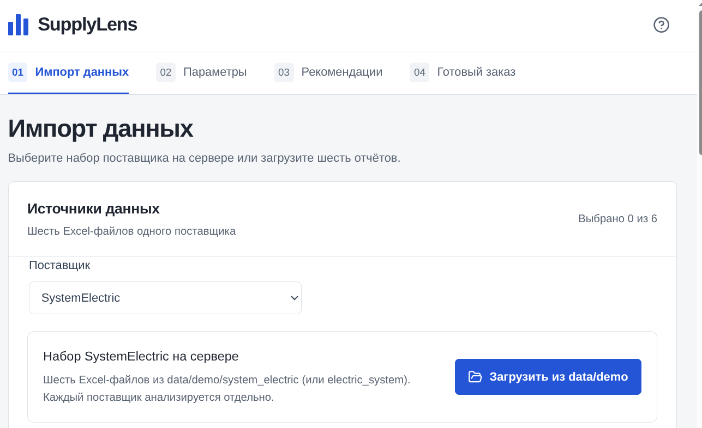
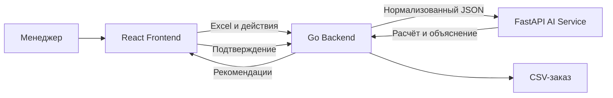

# SupplyLens



> AI-assisted система для планирования закупок и пополнения склада.

SupplyLens превращает разрозненные Excel-отчёты в проверяемые рекомендации для закупщика. Система объединяет продажи, остатки, сезонность, MOQ и товары в пути, рассчитывает потребность, отмечает подозрительные операции и формирует готовый заказ в CSV.

Решение разработано командой **NovaCoders** для трека «Логистика» хакатона **HackAlem AI**.

## Что умеет SupplyLens

- Загружает и проверяет шесть Excel-источников.
- Объединяет данные по точному коду товара `code1C`.
- Рассчитывает спрос с учётом сезонности и динамики продаж.
- Учитывает свободный остаток, резервы и товар в пути.
- Находит разовые крупные продажи и отправляет спорные позиции на проверку.
- Округляет заказ до установленной кратности MOQ.
- Показывает понятное объяснение каждого решения.
- Позволяет менеджеру изменить и подтвердить количество.
- Экспортирует подтверждённый заказ в CSV.

## Архитектура



| Компонент | Ответственность |
| --- | --- |
| Frontend | Загрузка файлов, параметры расчёта, таблица рекомендаций, подтверждение и экспорт |
| Go Backend | Проверка и разбор XLSX, хранение данных в памяти, вызов AI Service, решения менеджера и CSV |
| AI Service | Детерминированный расчёт потребности, анализ аномалий и понятное объяснение результата |

Frontend обращается только к Go Backend. API-ключи и адрес AI Service не передаются в браузер.

## Технологии

| Слой | Стек |
| --- | --- |
| Frontend | React, TypeScript, Vite, Tailwind CSS, Recharts |
| Backend | Go, `net/http`, Excelize |
| AI Service | Python, FastAPI, Pydantic, OpenAI SDK |
| Хранение | In-memory |
| Входные данные | XLSX |
| Результат | JSON и CSV |

## Быстрый запуск

### Требования

- Go 1.26.1+
- Node.js 22.12+ и npm
- Python 3.11–3.13
- Три отдельных терминала

Сервисы рекомендуется запускать в таком порядке:

```text
AI Service → Backend → Frontend
```

### 1. AI Service

Из корня проекта:

```bash
cd ai-service

python3 -m venv .venv
source .venv/bin/activate
python -m pip install -r requirements-dev.txt

AI_MODE=mock \
ALLOW_EXTERNAL_AI=false \
AI_LOCAL_MODE=true \
AI_SERVICE_TOKEN= \
python -m uvicorn app.main:create_app --factory \
  --host 127.0.0.1 \
  --port 8001 \
  --no-proxy-headers
```

Проверка:

```bash
curl --fail-with-body http://127.0.0.1:8001/health
```

Mock-режим не использует внешние API и подходит для локальной разработки и демонстрации. Расчёт количества остаётся настоящим — без внешнего AI выполняются локальный анализ и шаблонное объяснение.

### 2. Go Backend

Откройте второй терминал:

```bash
cd backend

AI_SERVICE_URL=http://127.0.0.1:8001 \
AI_SERVICE_TOKEN= \
go run ./cmd/api/main.go
```

Backend будет доступен по адресу `http://127.0.0.1:8080`.

Проверка:

```bash
curl --fail-with-body http://127.0.0.1:8080/healthz
```

### 3. React Frontend

Откройте третий терминал:

```bash
cd frontend
npm ci
VITE_API_BASE_URL=http://127.0.0.1:8080 npm run dev
```

Откройте в браузере адрес, который выведет Vite. По умолчанию:

```text
http://127.0.0.1:5173
```

## Повторный локальный запуск

После первоначальной установки зависимостей достаточно трёх команд в отдельных терминалах.

AI Service:

```bash
cd ai-service
source .venv/bin/activate
AI_MODE=mock ALLOW_EXTERNAL_AI=false AI_LOCAL_MODE=true AI_SERVICE_TOKEN= \
python -m uvicorn app.main:create_app --factory --host 127.0.0.1 --port 8001 --no-proxy-headers
```

Backend:

```bash
cd backend
AI_SERVICE_URL=http://127.0.0.1:8001 AI_SERVICE_TOKEN= go run ./cmd/api/main.go
```

Frontend:

```bash
cd frontend
VITE_API_BASE_URL=http://127.0.0.1:8080 npm run dev
```

## Запуск AI Service с OpenAI

Для реальных AI-объяснений задайте секреты только в окружении AI Service:

```bash
cd ai-service
source .venv/bin/activate

export AI_MODE=live
export ALLOW_EXTERNAL_AI=true
export AI_LOCAL_MODE=false
export AI_SERVICE_TOKEN="change-me"
export OPENAI_API_KEY="your-openai-api-key"
export OPENAI_MODEL="your-available-model"

python -m uvicorn app.main:create_app --factory \
  --host 127.0.0.1 \
  --port 8001 \
  --no-proxy-headers
```

Передайте тот же внутренний токен Backend:

```bash
cd backend
AI_SERVICE_URL=http://127.0.0.1:8001 \
AI_SERVICE_TOKEN="change-me" \
go run ./cmd/api/main.go
```

> Не помещайте `OPENAI_API_KEY` или другие секреты в `VITE_*`, исходный код, Git и HTTP-запросы Frontend.

## Пользовательский сценарий

1. Откройте раздел импорта.
2. Загрузите шесть Excel-файлов одного поставщика.
3. Проверьте найденные товары и предупреждения.
4. Укажите горизонт прогноза, срок поставки и страховой запас.
5. Запустите расчёт.
6. Проверьте позиции со статусом `REVIEW`.
7. При необходимости измените рекомендуемое количество.
8. Подтвердите позиции заказа.
9. Скачайте итоговый CSV.

## Необходимые Excel-файлы

| Источник | Для чего используется |
| --- | --- |
| MOQ | Минимальная партия и кратность заказа |
| Ежемесячные продажи | Основная история спроса по товарам |
| Детальные продажи | Поиск разовых крупных операций |
| Ежемесячные остатки | Поиск периодов отсутствия товара |
| Сезонность | Корректировка ожидаемого спроса по месяцам |
| Товар в пути | Свободный остаток, резервы, поставки и стоимость |

Backend принимает формат `.xlsx`. Пустое значение и настоящий ноль не считаются одним и тем же. Коды 1С обрабатываются как строки, поэтому ведущие нули и завершающий символ `_` сохраняются.

## Решения системы

| Статус | Значение |
| --- | --- |
| `BUY` | Товар рекомендуется заказать |
| `NO_BUY` | Текущего и ожидаемого запаса достаточно |
| `REVIEW` | Требуется решение менеджера из-за аномалии или качества данных |

AI не принимает окончательное решение за закупщика. Спорные продажи не исключаются автоматически, а итоговый заказ формируется только после подтверждения менеджером.

## Основные API

### Go Backend

| Метод | Endpoint | Назначение |
| --- | --- | --- |
| `GET` | `/healthz` | Состояние Backend |
| `POST` | `/api/v1/import` | Импорт шести XLSX-файлов |
| `GET` | `/api/v1/datasets/{datasetId}` | Результат проверки импорта |
| `POST` | `/api/v1/runs` | Запуск формирования рекомендаций |
| `GET` | `/api/v1/runs/{runId}` | Получение результата расчёта |
| `PATCH` | `/api/v1/runs/{runId}/items/{code1C}` | Решение менеджера и изменение количества |
| `POST` | `/api/v1/runs/{runId}/approve-export` | Формирование подтверждённого CSV |

### AI Service

| Метод | Endpoint | Назначение |
| --- | --- | --- |
| `GET` | `/health` | Состояние AI Service |
| `POST` | `/v1/recommendations` | Расчёт рекомендаций из нормализованного JSON |

Подробные модели запросов и ответов находятся в `ai-service/contracts/`.

## Переменные окружения

### Frontend

| Переменная | Пример | Назначение |
| --- | --- | --- |
| `VITE_API_BASE_URL` | `http://127.0.0.1:8080` | Адрес Go Backend |

### Backend

| Переменная | Пример | Назначение |
| --- | --- | --- |
| `HTTP_ADDR` | `127.0.0.1:8080` | Адрес HTTP-сервера |
| `CORS_ORIGINS` | `http://127.0.0.1:5173` | Разрешённые адреса Frontend |
| `AI_SERVICE_URL` | `http://127.0.0.1:8001` | Адрес AI Service |
| `AI_SERVICE_TOKEN` | `change-me` | Внутренний токен между Backend и AI Service |

### AI Service

| Переменная | Default | Назначение |
| --- | --- | --- |
| `AI_MODE` | `mock` | Режим `mock` или `live` |
| `ALLOW_EXTERNAL_AI` | `false` | Разрешение внешних AI-вызовов |
| `AI_LOCAL_MODE` | `false` | Разрешение локального mock без токена |
| `AI_SERVICE_TOKEN` | пусто | Внутренняя авторизация сервиса |
| `OPENAI_API_KEY` | пусто | Ключ OpenAI для live-режима |
| `OPENAI_MODEL` | задаётся окружением | Модель OpenAI |
| `AI_REQUEST_TIMEOUT_SECONDS` | `30` | Общий deadline одного запроса |

## Проверки

Frontend:

```bash
cd frontend
npm run lint
npm run typecheck
npm test
npm run build
```

Backend:

```bash
cd backend
go test ./...
go vet ./...
go build ./...
```

AI Service:

```bash
cd ai-service
source .venv/bin/activate
python -m pytest -q
python -m compileall -q app tests
python -m pip check
```

## Структура проекта

```text
.
├── frontend/       # React-приложение
├── backend/        # Go API, XLSX и CSV
├── ai-service/     # FastAPI, расчёт и AI-анализ
└── README.md
```

## Ограничения MVP

- Данные хранятся в памяти и сбрасываются после перезапуска Backend.
- Решение рассчитано на данные поставщика SystemElectric и формат предоставленных XLSX.
- Неполный сентябрь 2026 года не должен использоваться как полный месяц истории.
- Stockout определяется по месячным данным, без ежедневной истории остатков.
- Заказ поставщику не отправляется автоматически.
- Авторизация пользователей и постоянная база данных не входят в MVP.

## Принцип расчёта

```text
Прогноз спроса
+ страховой запас
- свободный остаток
- товар в пути
= сырая потребность
→ округление вверх до MOQ
```

Итоговое количество вычисляется кодом. AI используется для анализа спорных ситуаций и формирования понятного объяснения, но не придумывает количество заказа.

---

**SupplyLens — меньше ручной работы в Excel, больше прозрачности в закупках.**
